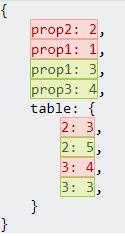
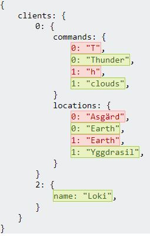

## React-json-differ

This package is based on [deep-object-diff](https://github.com/mattphillips/deep-object-diff) to display differences between two json objects in a similar fashion to : [angular-object-diff](https://github.com/hipster-labs/angular-object-diff)

## Usage
In a react project 

`npm i react-json-differ`

import component
```js
import { JsonDifferComponent } from 'react-json-differ'
```

usage
```jsx
<JsonDifferComponent object1={object1ToCompare} object2={object2ToCompare}/>
```


## css

If you want to use the default style for this component : 

```js
import "react-json-differ/dist/style.css";
```

Otherwise, these are all the class used that you can override:
```
.reactJsonDiffer__deleted
.reactJsonDiffer__updated
.reactJsonDiffer__added
.reactJsonDiffer__container
.reactJsonDiffer__level
```

## Examples 

```json
First object:
{prop1: 1, prop2: 2, table:[1,2,3,4]}
```

Second object:
```json
{prop1: 3, prop3: 4, table:[1,2,5,3]}
```



```json
First object:
{
  clients: [
    {name: "Thor", commands:"Thunder", locations:["Asgärd", "Earth"]},
    {name: "Odin", locations:["Asgärd"]}
  ]
}

Second object:
{
  clients: [
    {name: "Thor", commands:["Thunder", "clouds"], locations:["Earth", "Yggdrasil"]},
    {name: "Odin", locations:["Asgärd"]},
    {name: "Loki"}
  ]
};
```


## Caveats and a few more details :

This is not a perfect packages notably when showing differences on update: as you can see on the previous example, we replaced `commands:"Thunder"` with `commands:["Thunder", "clouds"]` and the difference shown doesn't show this easily at first glance.

Same thing could be said for the previous list example, we inserted a '5' before the '3' and removed the '4', but it shows as if we replaced 3 by 5 and 4 by 3

It is meant to have a quick glance at two massive json objects and see where the paths diverged. More analysis will be needed for details.

